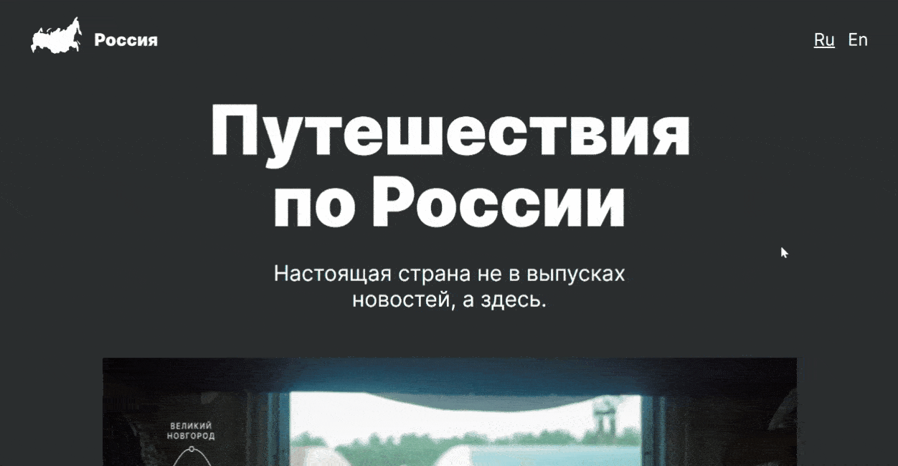

# Адаптивный одностраничный сайт о путешествиях по России.

Адаптивный сайт под 4 разрешения экрана с брейкпоинтами: 
*320px;
*768px;
*1024px;
*1280px;

## Превью

### Технологии
* HTML5
* CSS3
* BEM
* Flexbox
* Grid Layout

**Figma**

* [Ссылка на макет в Figma](https://www.figma.com/file/OyRWEjU6wBwRe1hapzQoLx/Sprint-3%3A-Russia-%2F-desktop-%2B-mobile?node-id=28503%3A0)

### Ссылка на проект

[Ссылка на проект](https://antb2142.github.io/russian-travel)
